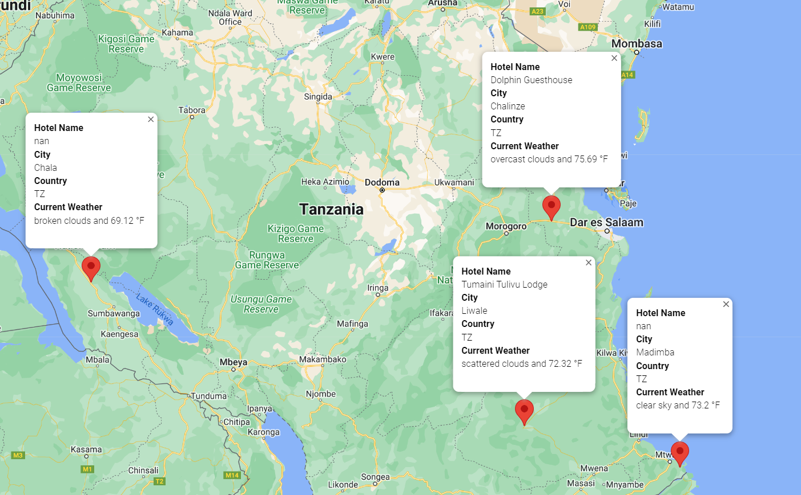

# World Weather Analysis

## Overview of Project
Analyze weather data on a randomly generated series of cities worldwide so that PlanMyTrip can use the data to recommend ideal hotels based on specific client weather preferences.

### Goals
- Generate 2,000 random latitudes and longitudes
- Use OpenWeatherMap API to request the current weather data from each unique city
- Generate a map of possible hotels based on max and min temperature requests by the customer
- Generate a possible travel itinerary for 4 cities

## Analysis

After randomly generating 2,000 latitudes and longitudes we cleaned the data for null Hotel Name values and created a chart:

We then asked for a possible destination and the customer chose Tanzania. We picked 4 popular cities and plotted a course from start to finish based on the customers maximum and minimum temperature requests.

Lastly we provided an image with hotel markers for the customer to see the following information on each hotel:

- Name
- City
- Country
- Current Weather

